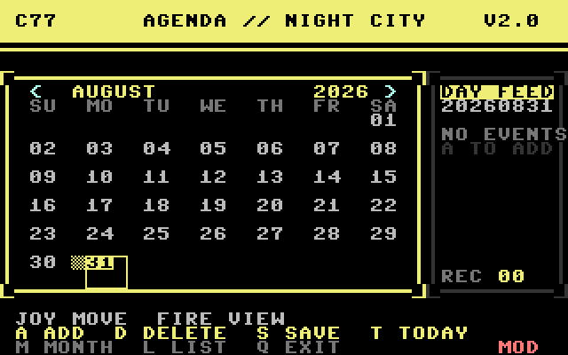

# C77 Agenda for Commodore 64

A graphical calendar and appointment organizer for the Commodore 64,
styled as a yellow-and-black C77 cyberpunk interface.

Version 3.0 uses a 320x200 hires bitmap, a Night City title screen, industrial
case badges, federal holidays, and short SID feedback.



## Editions

- `C77_AGENDA_GFX.d64` — native 6502 graphical edition (recommended)
- `C77_AGENDA.d64` — original BASIC V2 text edition

Both disk images contain a writable `AGENDA.DAT`. The graphical edition
retains the line-based data format used by the BASIC version.

## Run on C64 Ultimate

1. Copy `C77_AGENDA_GFX.d64` to USB storage.
2. Mount it as writable media in drive 8.
3. Load and run the first program:

```text
LOAD"*",8,1
RUN
```

Save before unmounting, then eject the disk image cleanly.

## Controls

| Input | Action |
| --- | --- |
| Joystick port 2 / cursor keys | Move selected date |
| Fire / Return | Inspect selected date |
| `A` | Add appointment |
| `D` | Delete first appointment on selected date |
| `S` | Save `AGENDA.DAT` |
| `T` | Set current date |
| `L` | Browse all appointments |
| `M` | Advance one month |
| `Q` | Save if modified and exit |

Federal holidays are calculated for the displayed year. Red day numbers are
holidays and red markers identify appointments.

Press `A` from the selected-date panel to add an appointment directly to that
date. Holiday titles are shown in the same panel.


## Build

The graphical edition requires [cc65](https://cc65.github.io/):

```sh
make CC65_ROOT=/path/to/cc65
make verify CC65_ROOT=/path/to/cc65
```

The build produces `C77_AGENDA_GFX.prg` and `C77_AGENDA_GFX.d64`.
`make verify` checks the D64 geometry, directory entries, file chains, and
embedded program size.

## Compatibility

The native edition targets the standard C64 KERNAL, VIC-II, CIA joystick
port, 1541-compatible sequential files, and the normal 64 KB memory map. It
is intended for C64 Ultimate, Ultimate 64, VICE, and original PAL/NTSC C64s.

See `C77_AGENDA_GFX_README.txt` for detailed operating notes.
